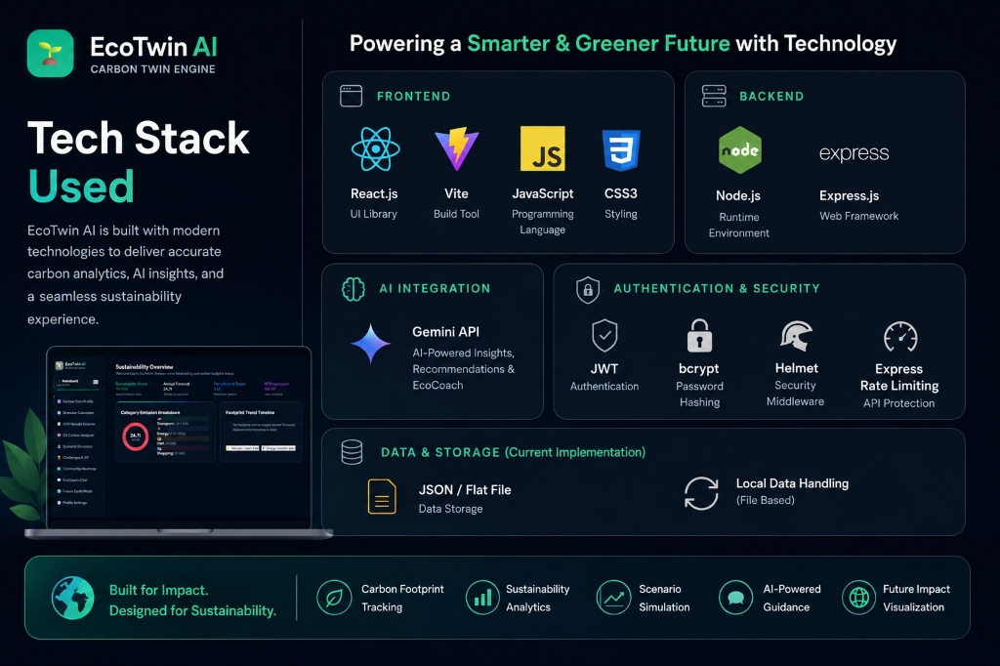

# 🌱 EcoTwin AI — Digital Carbon Twin & AI-Powered Sustainability Advisor

EcoTwin AI is a premium, full-stack, gamified carbon tracking and simulation platform designed to connect personal lifestyle choices with real-world environmental impact. By pairing interactive dashboard metrics with cutting-edge **Google Gemini AI**, EcoTwin AI generates a dynamic, predictive carbon twin of your lifestyle, allowing you to scan bills/objects, simulate future climate outcomes, and pledge actions to lower your footprint.

---

## 📖 Table of Contents
1. [✨ Key Features](#-key-features)
2. [🛠️ Tech Stack & Monorepo Architecture](#%EF%B8%8F-tech-stack--monorepo-architecture)
3. [💾 Database Architecture & Fallback System](#-database-architecture--fallback-system)
4. [🚀 Local Development Setup](#-local-development-setup)
5. [🌐 Environment Configuration](#-environment-configuration)
6. [📂 Folder Directory Structure](#-folder-directory-structure)
7. [☁️ Production Deployment Guide](#%EF%B8%8F-production-deployment-guide)
8. [🔒 Security & Rate-Limiting Policies](#-security--rate-limiting-policies)
9. [📄 License](#-license)

---

## ✨ Key Features

### ♊ 1. Digital Carbon Twin Profile
- Generates a customized narrative state representing your digital carbon avatar's environment (ranging from a **Lush Oasis** at $< 2.0$ tonnes CO₂/yr to a **Smoggy Industrial** wasteland at $> 10.0$ tonnes CO₂/yr).
- Computes real-time sustainability grades (**A** through **F**) and scores based on live activity statistics.

### 💬 2. EcoCoach AI Chatbot
- A personalized conversational assistant powered by Google Gemini, tailored directly to your footprint metrics, energy sliders, and active simulations.
- Returns clean HTML formatting and dynamically suggested follow-up questions to keep the conversation flowing.

### 🧾 3. AI-Powered OCR Receipt Scanner
- Allows users to upload utility, fuel, food, or shopping bills.
- Uses multi-modal vision models to identify costs, extract exact metrics (litres, kWh, item counts), and log the calculated carbon footprint directly to the user's ledger.

### 👁️ 4. CV Carbon Analyzer (Computer Vision)
- Analyzes photos of meals, vehicles, appliances, waste, or apparel.
- Instantly estimates lifecycle carbon impact (in kg CO₂), suggests eco-friendly green alternatives, provides confidence scoring, and unlocks the **"Eye of the Twin"** achievement badge.

### 🌍 5. Future Earth Projection Mode
- Models the climate state of your city 5, 10, and 20 years into the future based on your current footprint.
- Simulates vivid consequences (forest fires, smog alerts, water rationing, HVAC costs) and calculates the projected global temperature rise.

### ⚡ 6. Scenario Impact Simulator
- Toggles actionable adjustments (installing solar panels, switching to EVs, or shifting to vegetarian/vegan diets) to immediately calculate yearly financial savings and CO₂ offsets.

### 🎮 7. Gamification & Streaks
- Tracks daily and weekly sustainability challenges (e.g. *Public Transit Day*, *Zero Food Waste*, *Unplug the Vampires*).
- Features level progression (XP), streak counters, badges, and a community leaderboard.

### 🗺️ 8. Community Sustainability Heatmap
- Allows collaborative check-ins for planting trees or reporting waste pollution across local regions (e.g., *Mumbai District*, *San Francisco Bay Area*).

### 🛡️ 9. Intelligent Gemini Model Cascade
- Automatically queries the high-performance `gemini-2.5-flash` model, with seamless fallback/failover to `gemini-3.1-flash-lite` if the API encounters 503/429 limits or rate throttling.
- Integrates a smart, rule-based local fallback advisor to ensure full offline functionality when no API keys are configured.

---

## 🛠️ Tech Stack & Monorepo Architecture



The project is structured as an **NPM Workspace monorepo** to orchestrate dependencies easily across services:

- **Root Monorepo Manager:** Package workspace management via NPM.
- **Frontend App:** Built with React 18, Vite, CSS Variables (sleek dark mode, glassmorphic layout, Outfit typography, responsive grid), and dynamic inline SVG dashboard charts.
- **Backend API:** Node.js, Express, JSON Web Token (JWT) sessions, and Bcrypt security hashes.
- **AI Integrations:** Google Generative AI SDK (`@google/generative-ai`) handling multi-modal vision prompt engineering.

---

## 💾 Database Architecture & Fallback System

EcoTwin AI features a **dual-layer database engine** configured in `backend/database.js`:

1. **MongoDB Mode (Production-grade):** When a valid `MONGO_URI` is supplied in the `.env` file, the backend automatically connects to MongoDB via Mongoose, spinning up optimized indexed schemas.
2. **Local JSON Flat-File Fallback:** If MongoDB is offline or `MONGO_URI` is omitted, the app instantly falls back to an **offline-first local database** stored under `backend/data/` as JSON files (`users.json`, `footprints.json`, `activities.json`, etc.). This enables zero-config local development and testing.

---

## 🚀 Local Development Setup

### Prerequisites
- **Node.js** v18.0.0 or higher
- **NPM** v9.0.0 or higher

### 1. Install Dependencies
Run the command below from the **root directory** of the repository to install root, backend, and frontend packages simultaneously:
```bash
npm install
```

### 2. Set Up Environment Variables
Navigate to the `backend/` directory, copy the `.env.example` file, and fill in your credentials:
```bash
cd backend
cp .env.example .env
```
*(See the [Environment Configuration](#-environment-configuration) section below for variables details.)*

### 3. Run the Development Servers
From the root directory, launch both the Express backend and the React frontend development servers concurrently:
```bash
npm run dev
```
- **React Frontend Client:** running on [http://localhost:5173](http://localhost:5173)
- **Express Backend API:** running on [http://localhost:5000](http://localhost:5000)

---

## 🌐 Environment Configuration

### Backend Environment Configuration (`backend/.env`)

| Variable | Description | Default / Example |
| :--- | :--- | :--- |
| `PORT` | The port the backend server listens on. | `5000` |
| `JWT_SECRET` | Secret key used for signing JSON Web Tokens. | *Provide a long secure random string* |
| `GEMINI_API_KEY` | Google AI Gemini key to power EcoCoach chat, OCR, and CV scans. | *Your Google API Key* (If blank, fallbacks are active) |
| `MONGO_URI` | MongoDB Connection string. | `mongodb+srv://...` (If blank, local JSON mode starts) |
| `FRONTEND_URL` | Frontend URL for setting CORS headers. | `http://localhost:5173` |
| `CORS_ORIGIN` | Allowed origin header value for API access. | `http://localhost:5173` |

### Frontend Environment Configuration (`frontend/.env`)

| Variable | Description | Default / Example |
| :--- | :--- | :--- |
| `VITE_API_URL` | Endpoint base path for backend requests. | `http://localhost:5000` (Defaults to window origin if blank) |

---

## 📂 Folder Directory Structure

```text
carbon-tracker/
├── package.json               # Monorepo scripts (concurrently dev commands)
├── package-lock.json
├── backend/                   # Node.js + Express API Service
│   ├── package.json
│   ├── server.js              # Server entry point, middleware registration
│   ├── database.js            # DB Interface (MongoDB models + local JSON IO fallback engine)
│   ├── data/                  # Local JSON databases (created dynamically when offline)
│   ├── middleware/
│   │   └── auth.js            # JWT verification middleware
│   └── routes/
│       ├── auth.js            # Signup, Login, and profile verification routes
│       ├── tracking.js        # Sliders footprint tracking, travel log ledgers
│       ├── chat.js            # EcoCoach AI Chatbot conversation endpoints
│       ├── ai.js              # OCR Scanning, CV Analyzer, Digital Twin, Future Earth Mode
│       ├── gamification.js    # Challenges, streaks, badges, leaderboard scores
│       └── community.js       # Heatmap nodes, tree planting activities, waste reports
└── frontend/                  # React + Vite Client Application
    ├── package.json
    ├── vite.config.js
    ├── index.html
    └── src/
        ├── main.jsx           # App entry point
        ├── App.jsx            # Core dashboard layout, sub-views, and API controllers
        ├── App.css            # Layout CSS overlays
        ├── index.css          # Main styling tokens (Dark mode theme, CSS animations)
        └── components/
            └── Chart.jsx      # Custom SVG Donut & Bar chart components
```

---

## ☁️ Production Deployment Guide

### Option A: Unified Monolithic Deployment (Recommended)
Host both the static frontend bundle and the Node.js API from a single server (e.g., Render, Railway, Heroku).

1. Define the following configurations on your host provider:
   - **Build Command:** `npm install && npm run build`
   - **Start Command:** `npm run start:backend`
2. Environment Variables:
   - `NODE_ENV=production`
   - `PORT=5000` (or host dynamic port)
   - `JWT_SECRET=your_production_secure_signing_token`
   - `GEMINI_API_KEY=your_gemini_api_cascade_key`
   - `MONGO_URI=your_production_mongodb_connection_uri`

### Option B: Decoupled Deployments (Static Client + API Server)
Host the React client on CDN providers (Vercel, Netlify) and the backend API on a separate virtual machine.

#### 1. API Backend Setup (e.g. Render / Railway)
- **Build Command:** `npm install`
- **Start Command:** `node server.js`
- Set `FRONTEND_URL` and `CORS_ORIGIN` to match your deployed Vercel domain.

#### 2. Static Frontend Setup (e.g. Vercel / Netlify)
- **Root directory:** `frontend`
- **Build Command:** `npm run build`
- **Output directory:** `dist`
- Environment Variables: Set `VITE_API_URL` to your backend API's server URL (e.g. `https://api.your-app.com`).

---

## 🔒 Security & Rate-Limiting Policies

To ensure platform resilience and safeguard external AI usage, the following measures are integrated:
- **Header Hardening:** Express utilizes `helmet` to lock down browsers against Clickjacking and XSS.
- **CORS Constraints:** Strictly configures allowed origins, with active sanitizer routines stripping trailing slashes from environmental hosts to avoid double-slash 404 connection glitches.
- **Multilayered Throttling:** Utilizes `express-rate-limit` engines to separate endpoints:
  - Auth limits: Restricts register/login requests.
  - Global endpoints: Prevents high-frequency API calls.
  - AI endpoints: Protects the Gemini key from rapid scraping loops.

---

## 📄 License

This project is licensed under the MIT License - see the [LICENSE](LICENSE) file for details.
