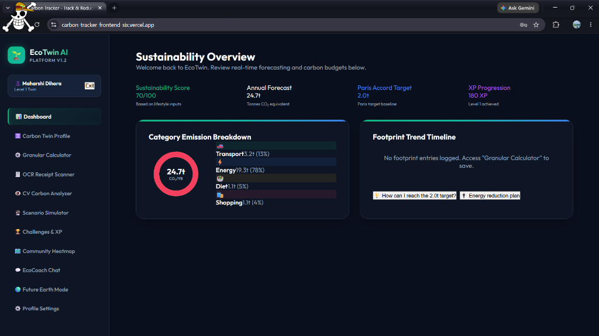
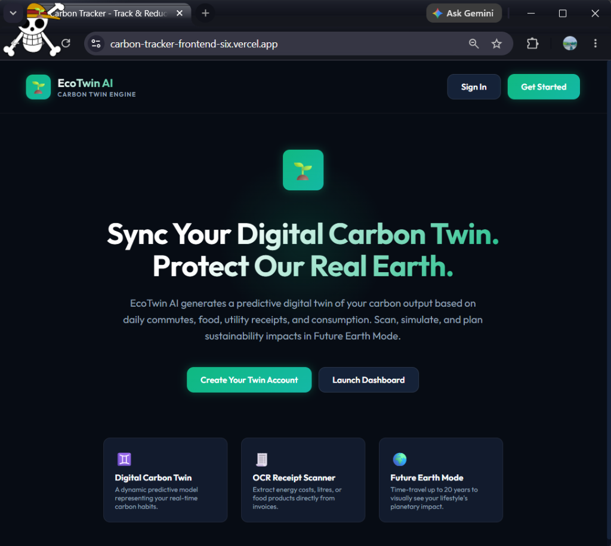
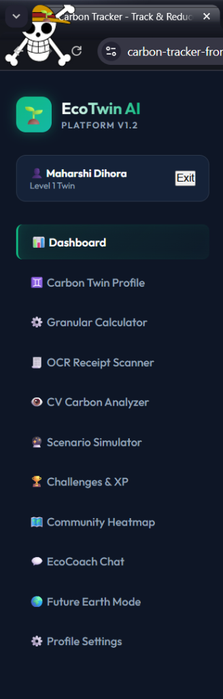

# 🌱 EcoTwin AI — Digital Carbon Twin & AI-Powered Sustainability Assistant

EcoTwin AI is a full-stack AI-powered sustainability assistant that helps users track, understand, and reduce their carbon footprint through personalized analytics, simulations, and eco-guidance.

Built as a smart assistant platform, EcoTwin AI creates a digital carbon twin of a user’s lifestyle using inputs such as transport habits, energy usage, food choices, and shopping behavior. It then turns those inputs into actionable sustainability insights through dashboards, AI recommendations, OCR scanning, scenario simulations, and future impact forecasting.

---

## 🛠️ Tech Stack & Monorepo Architecture


---

# 📸 Project Screenshots

## Landing Page


## Sustainability Dashboard


## Feature Navigation & Modules


---

# 🚀 Hackathon Submission Overview

### Chosen Vertical
- **Sustainability / Climate-Tech Assistant**

### Target Persona
- **Individuals** who want to understand how their daily lifestyle choices affect the environment and need an intelligent assistant to guide them toward lower-carbon habits.

### Problem Statement
- People often want to live more sustainably, but they lack a simple and practical way to measure how their everyday activities—such as commuting, electricity usage, food consumption, and shopping—contribute to their carbon footprint.
- Most existing solutions either provide static calculators or generic advice. They do not adapt to the user’s behavior, provide contextual recommendations, or simulate long-term environmental impact in an engaging way.

### Solution
- **EcoTwin AI** addresses this by acting as a dynamic carbon sustainability assistant. It builds a digital carbon twin of the user, analyzes carbon-heavy categories, provides AI-driven recommendations, and helps the user explore greener alternatives through simulations and future impact visualization.

---

# ✨ Key Features

### 1) Digital Carbon Twin Dashboard
- Tracks a user’s sustainability score and annual carbon forecast.
- Breaks down emissions into categories such as **Transport**, **Energy**, **Diet**, and **Shopping**.
- Creates a dynamic “carbon twin” profile representing the user’s current environmental footprint.

### 2) EcoCoach AI Chat
- Personalized AI sustainability assistant powered by **Google Gemini**.
- Uses the user’s footprint context to answer questions and suggest practical improvements.
- Helps users understand which lifestyle changes can reduce emissions most effectively.

### 3) OCR Receipt Scanner
- Lets users upload utility, food, shopping, or fuel bills.
- Extracts meaningful data from receipts using AI vision/OCR.
- Converts scanned data into carbon-related activity records.

### 4) CV Carbon Analyzer
- Accepts images of meals, vehicles, appliances, waste, or shopping items.
- Estimates possible carbon impact from the uploaded image.
- Suggests eco-friendly alternatives or lower-impact choices.

### 5) Future Earth Mode
- Simulates the long-term impact of current user habits.
- Helps users visualize environmental outcomes 5, 10, or 20 years into the future.
- Makes carbon impact more understandable and emotionally engaging.

### 6) Scenario Impact Simulator
- Lets users test “what-if” sustainability changes such as:
  - Switching to EVs
  - Reducing meat consumption
  - Installing solar panels
  - Lowering energy usage
- Shows possible carbon savings and lifestyle impact.

### 7) Challenges & XP
- Gamifies sustainability improvement.
- Includes progress tracking, XP rewards, streaks, and challenge-based engagement.

### 8) Community Sustainability Heatmap
- Supports community-driven sustainability actions and awareness.
- Encourages environmental participation beyond individual tracking.

---

# 🧠 Smart Assistant Logic

A major focus of this project is not just carbon tracking, but building a smart, context-aware assistant.

### How EcoTwin AI behaves like an assistant
EcoTwin AI takes user-specific context and uses it to generate relevant guidance. It does this through the following logic:

1. **Collects user lifestyle context:** The platform gathers information from:
   - Dashboard inputs & granular carbon calculator entries
   - Scanned receipts & image analysis
   - Previous footprint records & simulation choices
2. **Identifies high-emission categories:** The system evaluates which areas contribute the most to the user’s footprint, such as:
   - High transport emissions
   - Heavy electricity usage
   - Carbon-intensive food habits
   - Frequent shopping-related impact
3. **Applies personalized assistant reasoning:** Based on the detected patterns, the assistant provides contextual guidance such as:
   - Transport reduction strategies if commute emissions are high.
   - Electricity-saving suggestions if energy usage dominates.
   - Food habit improvements if diet emissions are significant.
   - Behavior change ideas if shopping waste is high.
4. **Supports decision-making through simulation:** Instead of only showing current emissions, the system allows users to test alternative behaviors and compare impact before making real-life changes.
5. **Makes sustainability more actionable:** The assistant turns abstract environmental data into actionable recommendations, future impact visualizations, goal-oriented suggestions, and progress-based motivation through gamification.

> [!NOTE]
> This directly aligns with the hackathon goal of building a smart, dynamic assistant that makes logical decisions based on user context.

---

# ⚙️ Tech Stack

- **Frontend:** React.js, Vite, JavaScript, CSS3
- **Backend:** Node.js, Express.js
- **AI Integration:** Google Gemini API
- **Authentication & Security:** JWT (JSON Web Tokens), bcrypt, Helmet, express-rate-limit
- **Data Layer:** MongoDB support (when configured), Local JSON fallback storage for offline / lightweight usage.

---

# 🏗️ Architecture Overview

EcoTwin AI follows a full-stack architecture:

- **Frontend:** Handles dashboard UI, data entry, simulation screens, AI interaction views, and visualization of footprint data.
- **Backend API:** Handles authentication, carbon activity processing, assistant routing, OCR / CV requests, and simulation and scoring logic.
- **AI Layer:** Used for EcoCoach AI responses, OCR interpretation, CV carbon analysis, and sustainability recommendations.
- **Data Storage Layer:** Stores user profiles, footprint logs, sustainability progress, activity records, and assistant-related data.

---

# 🔄 How the System Works

* **Step 1 — User logs in or creates an account:** The user enters the platform and creates a sustainability profile.
* **Step 2 — User provides lifestyle input:** The user can enter carbon-related activity data manually, use the granular calculator, scan receipts, or upload images for analysis.
* **Step 3 — System calculates footprint:** The platform processes the data and estimates category-wise carbon impact.
* **Step 4 — Dashboard visualizes the result:** The user sees their sustainability score, annual forecast, category emission breakdown, and target comparison.
* **Step 5 — AI assistant gives contextual guidance:** EcoCoach AI uses the user’s data to provide personalized recommendations and answers.
* **Step 6 — User explores simulations and future impact:** The user can test sustainable choices and view projected outcomes through simulations and Future Earth Mode.

---

# 📂 Project Structure

```text
carbon-tracker/
├── package.json
├── backend/
│   ├── package.json
│   ├── server.js
│   ├── database.js
│   ├── data/
│   ├── middleware/
│   │   └── auth.js
│   └── routes/
│       ├── auth.js
│       ├── tracking.js
│       ├── chat.js
│       ├── ai.js
│       ├── gamification.js
│       └── community.js
└── frontend/
    ├── package.json
    ├── vite.config.js
    ├── index.html
    └── src/
        ├── main.jsx
        ├── App.jsx
        ├── App.css
        ├── index.css
        └── components/
            └── Chart.jsx
```

---

# 🗄️ Database Strategy

EcoTwin AI supports a flexible data storage model:
- **MongoDB Mode:** If a valid MongoDB connection string is provided, the backend uses MongoDB for persistent, production-ready storage.
- **Local JSON Fallback:** If MongoDB is not configured, the project falls back to local JSON files stored inside the backend data directory. This makes the project easier to run locally and useful for lightweight testing.

---

# 🚀 Local Setup

### Prerequisites
- Node.js v18+
- npm

### Installation
From the root of the repository:
```bash
npm install
```

### Environment Setup
Inside the `backend` folder, create a `.env` file based on `.env.example`.
```env
PORT=5000
JWT_SECRET=your_jwt_secret
GEMINI_API_KEY=your_gemini_api_key
MONGO_URI=your_mongodb_uri
FRONTEND_URL=http://localhost:5173
CORS_ORIGIN=http://localhost:5173
```

Frontend environment (`frontend/.env`):
```env
VITE_API_URL=http://localhost:5000
```

### Run the Project
From the root folder:
```bash
npm run dev
```
- **Frontend runs on:** [http://localhost:5173](http://localhost:5173)
- **Backend runs on:** [http://localhost:5000](http://localhost:5000)

---

# 🔐 Security Considerations

The project includes several security-focused measures:
- JWT-based authentication
- Password hashing using bcrypt
- Helmet for safer HTTP headers
- Rate limiting to protect auth and AI endpoints
- Controlled CORS configuration
- Fallback behavior when AI services are unavailable

---

# 🧪 Assumptions Made

- Carbon impact values are estimated based on predefined rules, category logic, and AI-assisted interpretation.
- OCR and CV results are treated as supporting sustainability estimates, not perfect environmental measurements.
- Future Earth Mode is intended as an awareness and projection feature rather than a scientific climate prediction engine.
- AI recommendations are designed to be practical guidance, not legal, medical, or certified environmental advice.

---

# 🎯 Why This Project Fits the Hackathon

This project is aligned with the challenge requirements because it demonstrates:
- **Smart, dynamic assistant behavior:** EcoTwin AI does more than calculate emissions—it analyzes user context and responds with personalized sustainability guidance.
- **Logical decision-making:** The system identifies major carbon contributors and tailors recommendations based on user-specific activity patterns.
- **Real-world usability:** Carbon tracking, receipt scanning, future simulations, and guided recommendations address a practical everyday problem.
- **Maintainable code structure:** The project uses a structured full-stack architecture with separated frontend, backend, middleware, and route layers.
- **Security and accessibility awareness:** The platform includes authentication, request protection, and a user-friendly dashboard approach designed for understandable sustainability insights.

---

# 🔮 Future Improvements

- More accurate region-based emission factor datasets.
- Stronger personalized recommendation ranking.
- Richer community sustainability analytics.
- Improved OCR extraction pipelines.
- Mobile-first optimization.
- Deeper carbon budgeting and target planning tools.

